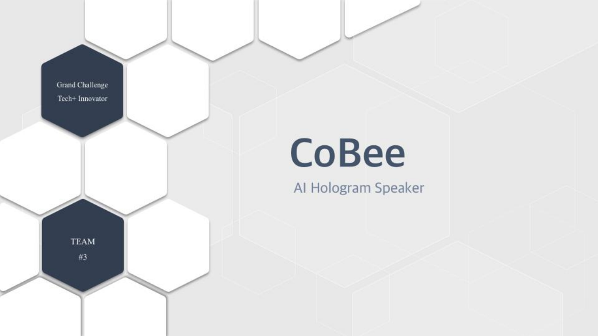
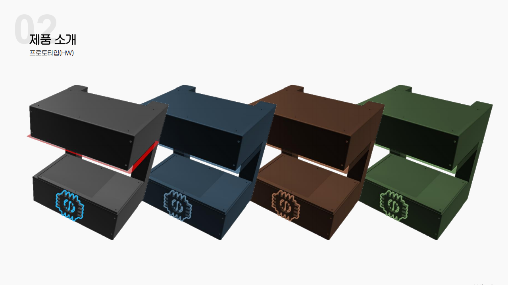
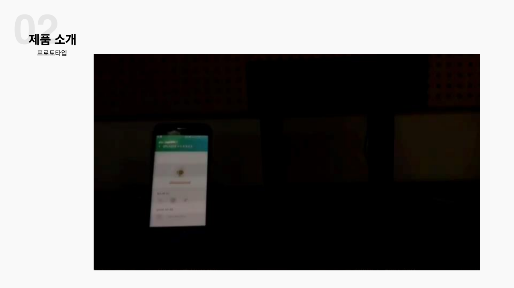
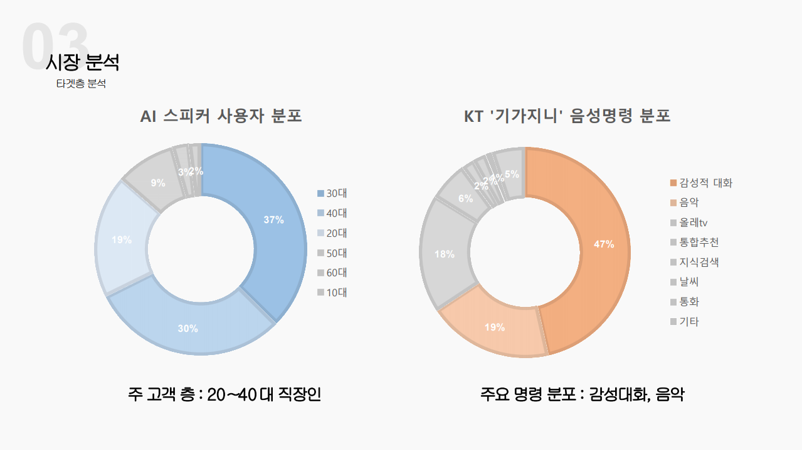
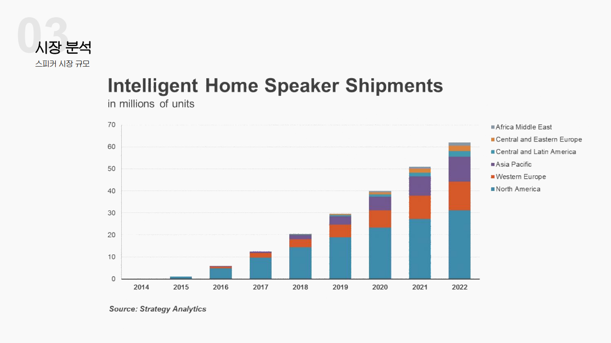

# AI Hologram Speaker

## 프로잭트 설명

* 홀로그램을 이용한 스피커.
* 음악의 분위기나 날씨에 맞는 홀로그램을 띄워줘 기존 시중에 나와있는 AI Speaker 와의 차별성을 도입하려 함.

## 개발 기간

* 2017년 상하반기

## 내가 한 부분

* Speaker 제어를 위한 Android application 부분을 담당했다.
* Raspberry Pi 와 Android application 과의 bluetooth 통신
* Android application 에서 google map 과 날씨 api 활용 현재 날씨 받아오는 기능
* Android application 에서 그림을 그리고 raspberry pi 에 전송하는 기능

## 프로젝트에 사용된 기술

* Android
* Raspberry Pi

## 발표 ppt

## 느낀점
